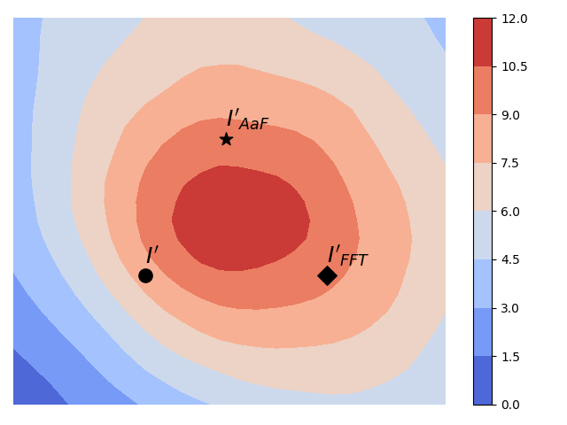
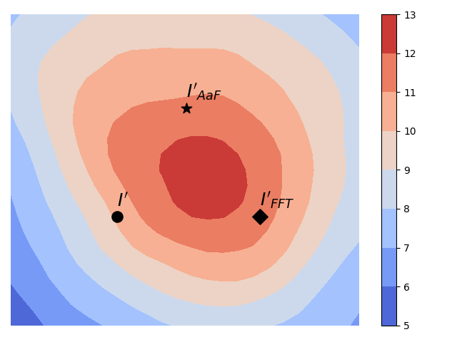
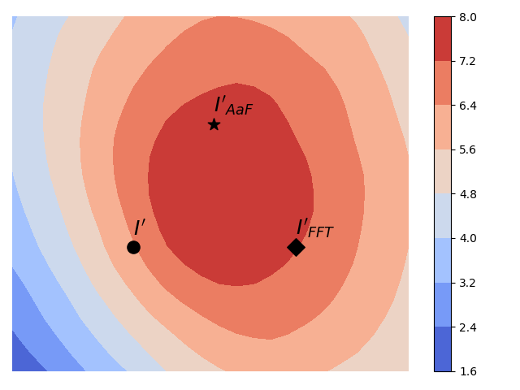
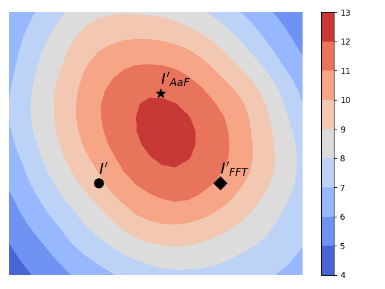
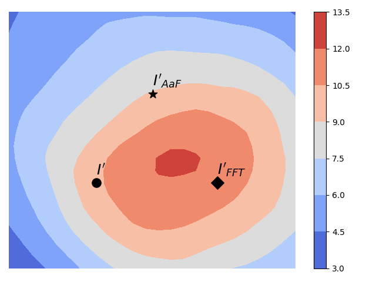
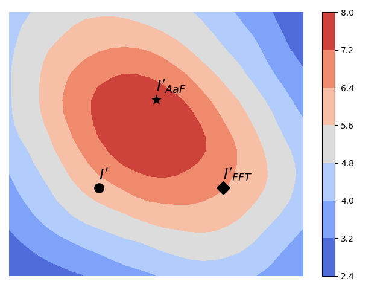
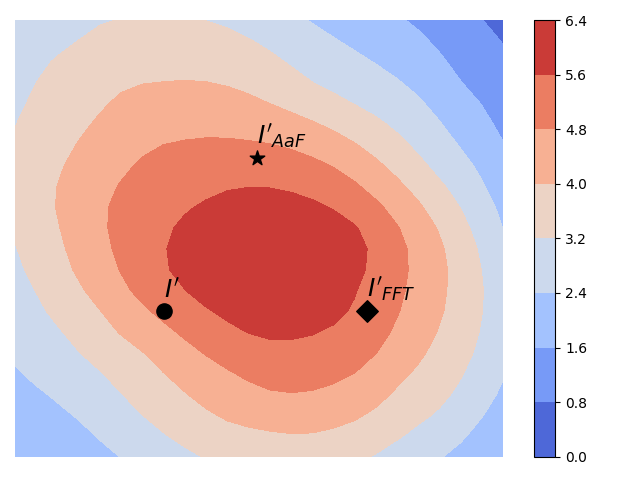
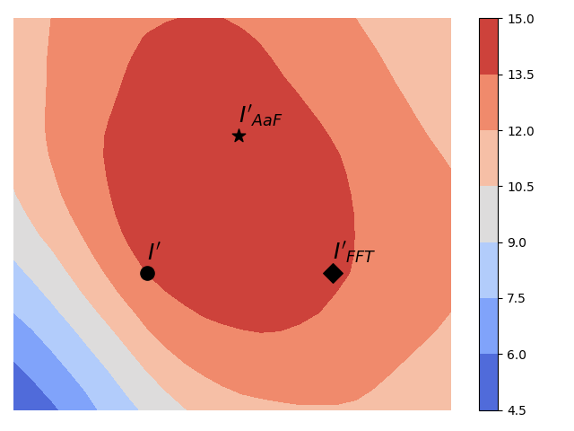
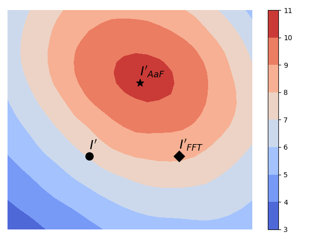

# Avg_FT
Codes for our paper to 2025ICASSP: Two Heads Are Better Than One: Averaging along Fine-Tuning to Improve Targeted Transferability. [arXiv](https://arxiv.org/abs/2412.20807)

Our key assumption is that an AE located at the center of high-confidence (w.r.t. yt) region may transfer better across unknown models than that located near the boundary of the high-confidence region. As shown in below, without cherry-picking, the proposed AaF steers AE towards a more central region than FFT, let alone the baseline attack (I'). The AEs are crafted with a Resnet50 (source model), while the planes are calculated on an ensemble of target models. 

  

  

In the supplementary file 'supp.pdf', we provide more detailed results:

- Pseudo-code of the proposed method;
- Ablation study on the decaying factor gamma;
- Visualization of FFT and AaF in a 2D subspace;
- Attack performance against four transformer-based models;
- Attack performance in the most difficult-target scenario; 
- Visual comparison. 

## Usage
Please run main_Avg_FT.py to see the targeted transferability improvement by the proposed AaF method.

